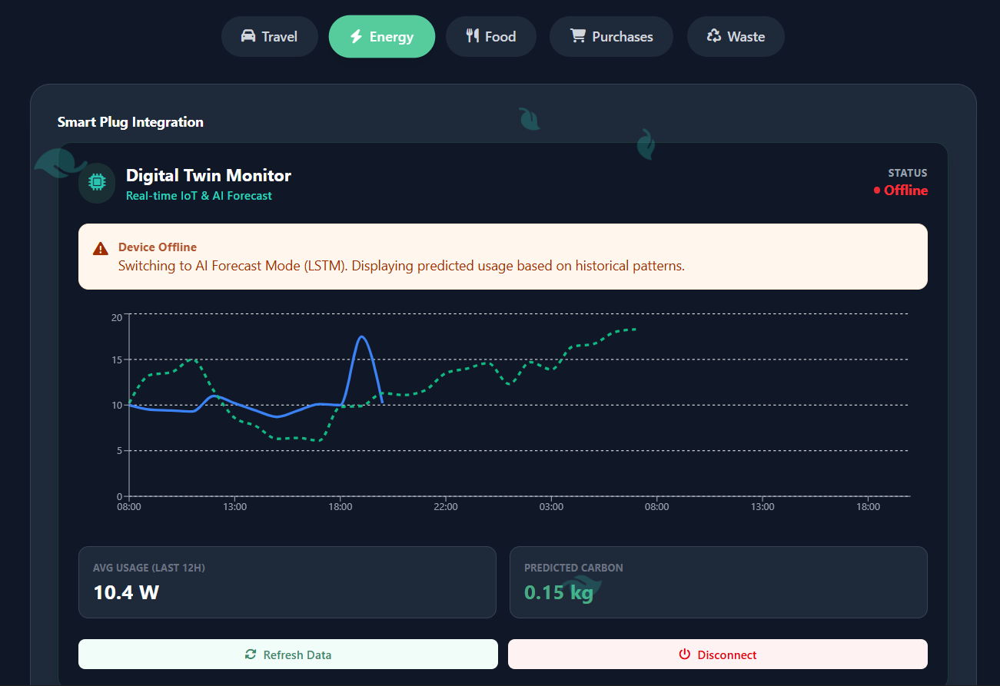
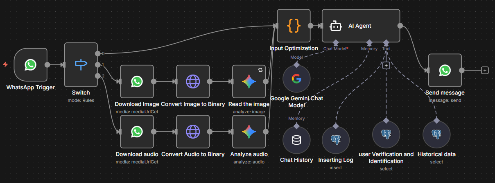
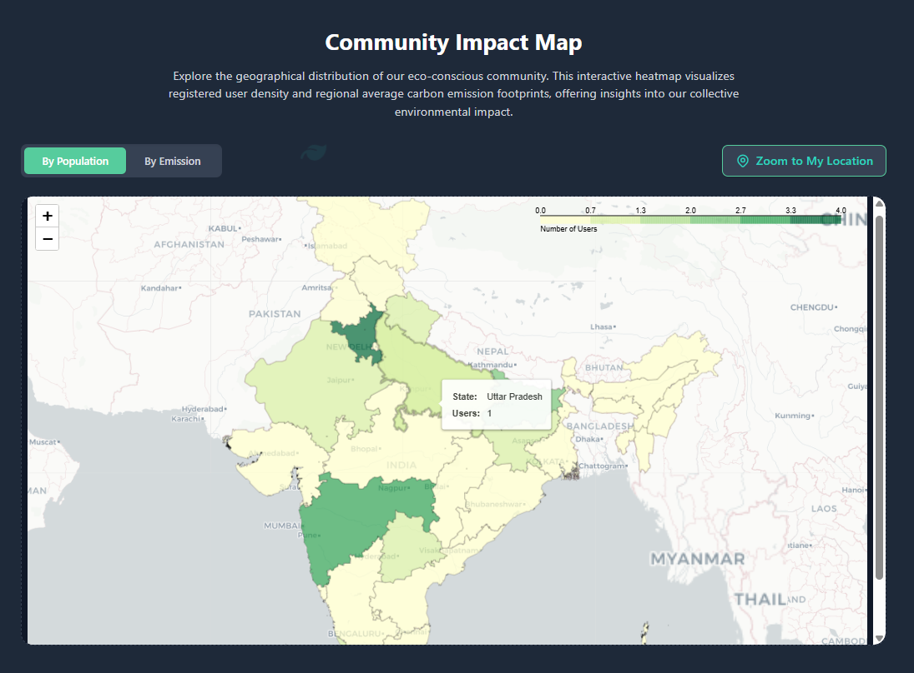
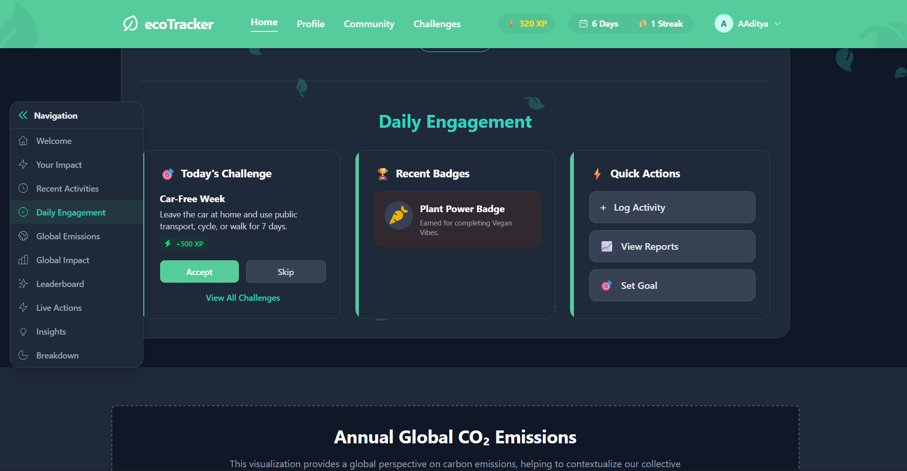
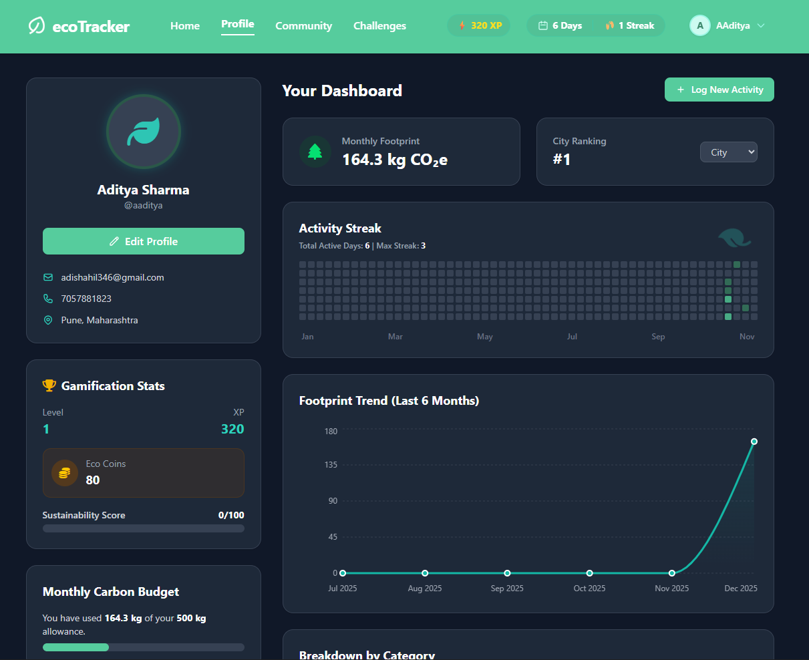
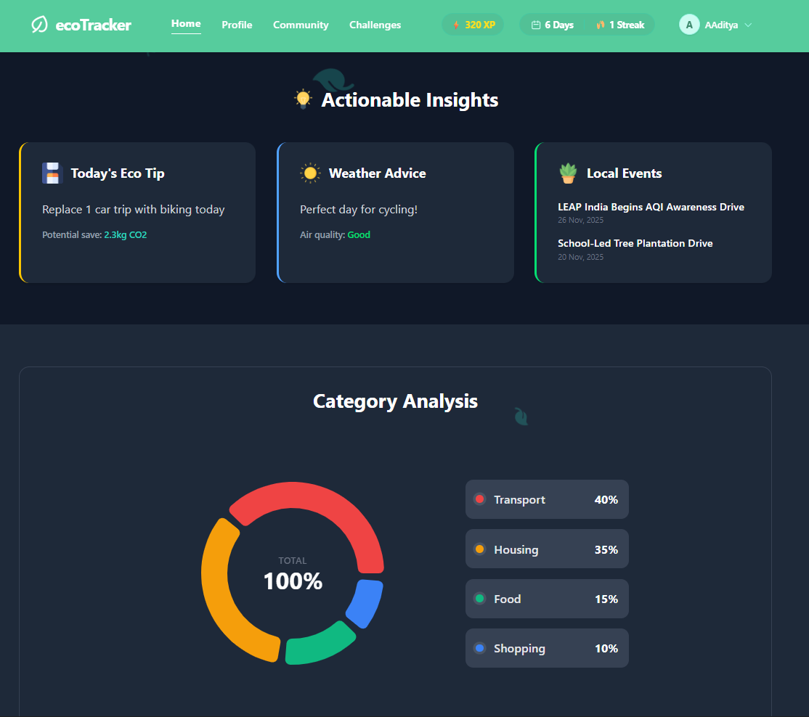
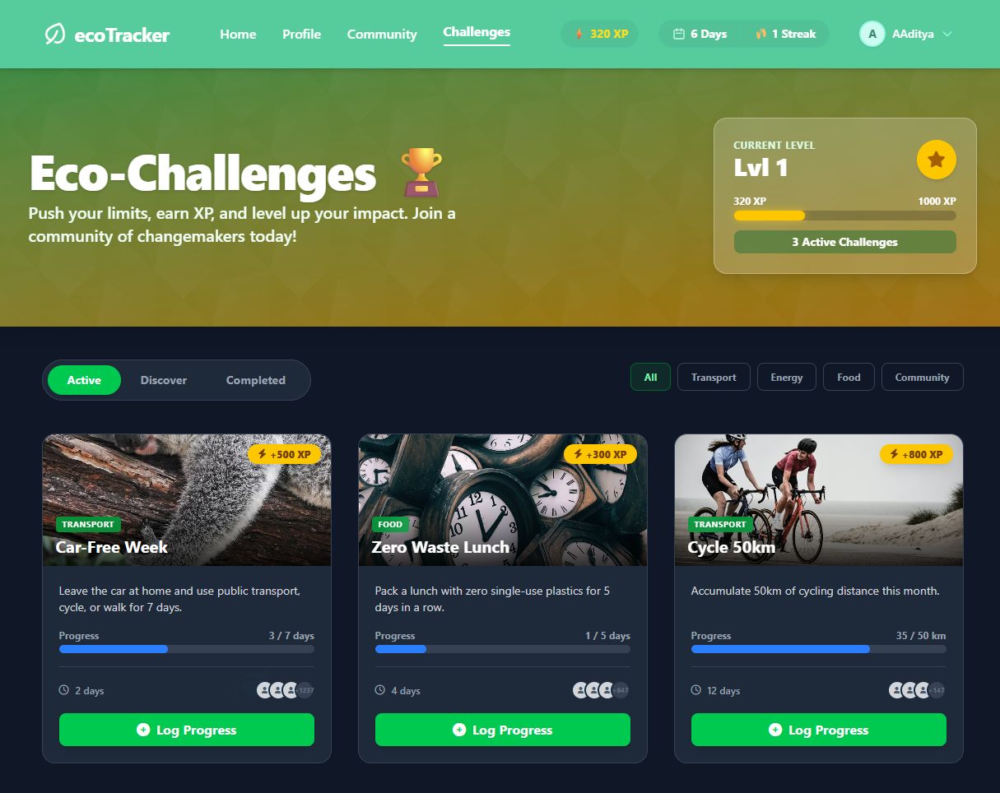
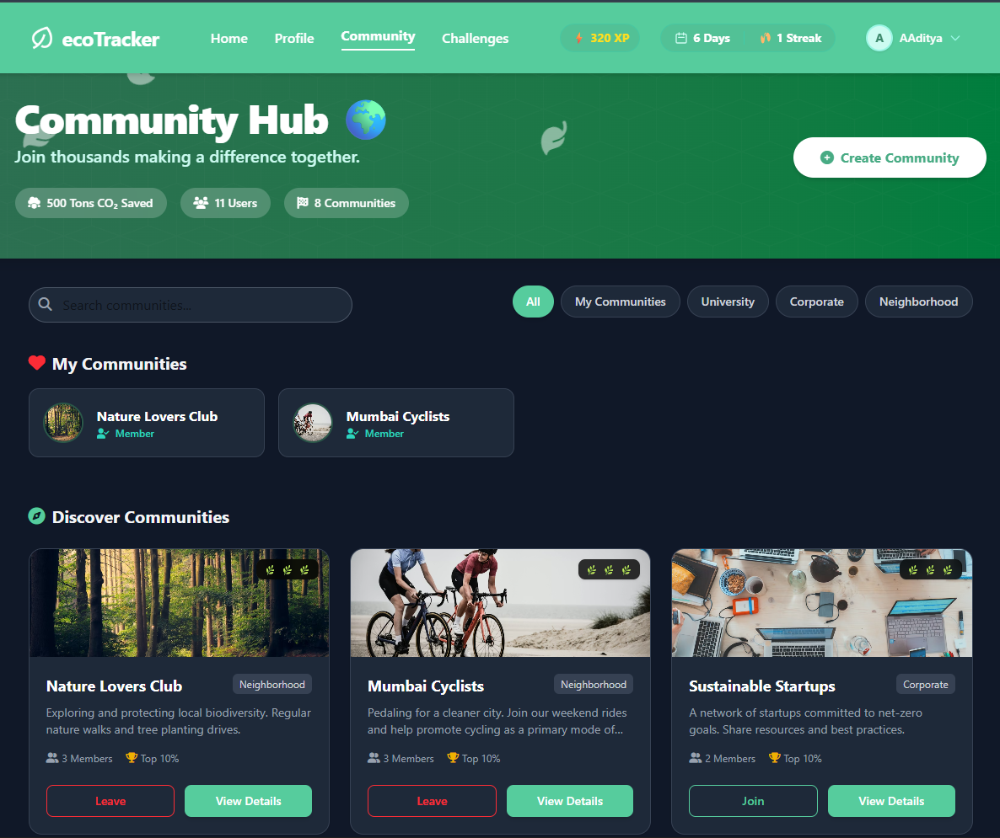

# EcoTrack: Intelligent Carbon Monitoring Ecosystem


## 📖 Abstract

In the fight against climate change, accurate data is the first step toward actionable reduction. **Existing carbon trackers rely heavily on manual entry**, which is prone to human error and lacks verification. 

**EcoTrack** solves this by deploying a **multi-modal ecosystem** that bridges the physical and digital worlds. By combining **Hardware (IoT)** for real-time sensing, **Software (Web/App)** for seamless interaction, and **AI (Prediction/Vision)** for intelligent automation, EcoTrack provides a comprehensive, verified, and automated carbon footprint monitoring solution.

---

## 🚀 Key Novelty Features

### 1. Precision IoT Monitoring (Hardware Layer)
Unlike standard energy monitors that estimate usage, our **ESP32-based Smart Meter** utilizes **ZMPT101B (Voltage)** and **SCT-013 (Current)** sensors to calculate **True Power** ($P=VI\cos\theta$).
- **Real-Time Data:** Streams millisecond-level energy data to the cloud.
- **Digital Twin Dashboard:** Maintains a virtual state of the device, handling offline scenarios and syncing data once connectivity is restored.

### 2. AI-Driven Forecasting (LSTM)
We move beyond simple tracking to **predictive analytics**.
- **Model:** Long Short-Term Memory (LSTM) Recurrent Neural Network.
- **Function:** Analyzes historical time-series data to predict future energy consumption, allowing users to take proactive measures before limits are exceeded.

### 3. Accurate Emission Calculation (Random Forest)
Static emission factors are often outdated. EcoTrack employs a **Hybrid ML Model (RandomForestRegressor)** tailored to dynamic usage patterns.
- **Training Data:** Trained on over **15,000 synthetic data points**.
- **Result:** Replaces static coefficients with dynamic predictions for highly accurate carbon footprint estimation.

### 4. Zero-Friction Logging (n8n + Gemini)
Manual logging is a barrier to adoption. We removed it using a **WhatsApp Chatbot** powered by **n8n orchestration**.
- **📸 Vision:** Users send photos of electricity bills or waste bins → **Google Gemini Vision** extracts data automatically.
- **🗣️ Voice:** Users send voice notes describing their commute → **OpenAI Whisper** transcribes and processes the activity.
- **Integration:** Data is automatically cleaned and synced to the **Supabase** database.

### 5. Geospatial Intelligence
- **Community Impact:** Visualizes carbon footprints on a **Folium/Geopandas Heatmap**, allowing communities to compare benchmarks and identify high-impact zones.

### 6. Hardware-Verified Gamification
- **Cheat-Proof System:** Badges and XP are awarded strictly based on **verified IoT data** rather than self-reported claims, ensuring the integrity of the leaderboard and reward system.

---

## 🏗️ System Architecture


> *[Mermaid Diagram Placeholder]*

**Data Flow:**
1.  **Sensors (ESP32)** measure physical parameters (Voltage, Current).
2.  **API (Django)** receives verified payloads.
3.  **ML Engine** processes timeseries for forecasting and anomaly detection.
4.  **Dashboard (React)** visualizes real-time insights and community stats.

---

## 💻 Tech Stack

### Frontend
- **Framework:** React.js
- **Styling:** Tailwind CSS, Framer Motion (Animations)
- **Visualization:** Recharts (Charts), Folium (Maps)

### Backend & AI
- **API:** Django REST Framework (DRF)
- **Database:** PostgreSQL / Supabase
- **AI/ML:** Python, Pandas, Scikit-Learn (Random Forest), TensorFlow/Keras (LSTM), Google Gemini API (Vision)
- **Orchestration:** n8n (Workflow Automation)

### Hardware (IoT)
- **Microcontroller:** ESP32 (C/C++ Firmware)
- **Sensors:** ZMPT101B (Voltage), SCT-013 (Current)
- **Protocol:** MQTT / HTTPs

### DevOps
- **Containerization:** Docker
- **Version Control:** Git

---

## 🛠️ Installation & Setup

### Prerequisites
- Node.js & npm
- Python 3.9+
- PostgreSQL
- ESP32 Development Board (for hardware module)

### 1. Clone the Repository
```bash
git clone https://github.com/your-username/EcoTrack.git
cd EcoTrack
```

### 2. Backend Setup
```bash
cd backend
pip install -r requirements.txt
python manage.py migrate
python manage.py runserver
```

### 3. Frontend Setup
```bash
cd frontend
npm install
npm run dev
```

### 4. Hardware Setup
1.  Connect the **ZMPT101B** and **SCT-013** sensors to the ESP32 GPIO pins as per the circuit diagram.
2.  Configure your WiFi credentials in `firmware/config.h`.
3.  Flash the firmware using Arduino IDE or PlatformIO.

---

## 📱 Screenshots

| Live Energy Dashboard | WhatsApp Chatbot Flow |
|:---:|:---:|
|  |  |

| Community Heatmap | Daily Engagement |
|:---:|:---:|
|  |  |

| Personalised Dashboard | Actionable Insights |
|:---:|:---:|
|  |  |

| Sustainability Challenges | Community Leaderboard |
|:---:|:---:|
|  |  |


---

## 📄 License
This project is open-source and available under the **MIT License**.
